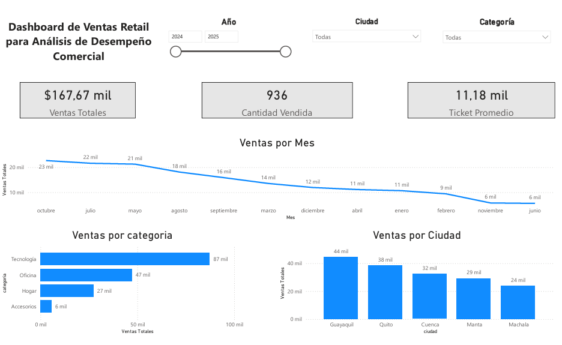

# 📊 Dashboard de Ventas Retail – Power BI

## 🧠 Objetivo

Este proyecto presenta un dashboard interactivo desarrollado en Power BI para analizar el comportamiento de ventas en un entorno retail.

## 📌 KPIs principales

* 💰 Ventas Totales
* 📦 Cantidad Vendida
* 🧾 Ticket Promedio

## 📈 Análisis realizados

* Tendencia de ventas por mes
* Comparación de ventas por categoría
* Análisis de ventas por ciudad

## 🎛️ Funcionalidades

* Filtros interactivos por:

  * Año
  * Ciudad
  * Categoría
* Visualizaciones dinámicas

## 🛠️ Tecnologías utilizadas

* Power BI
* Excel

## 📷 Vista del dashboard

